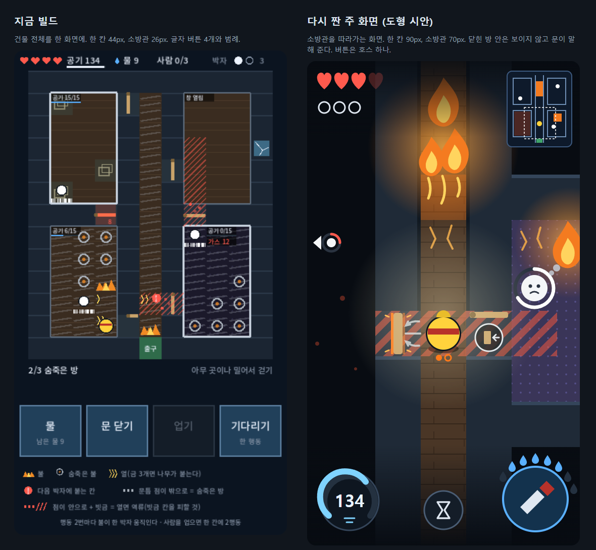

# 주 화면을 설계하는 법

이 회사의 첫 빌드 기준: **내용은 적어도 된다. 요소·구조·화면은 그림만 갈아 끼우면 바로 상용 게임이 될 수준이어야 한다.**

여기에 닿는 길은 문서를 길게 쓰는 것이 아니라 **화면을 추론하는 것**이다.
지금까지의 빌드가 전부 "위에서 본 판, 작은 말, 글자 버튼, 범례"였던 이유는 이 추론이 과정에 없었기 때문이다:
규칙을 적은 다음 "위는 상태, 가운데는 판, 아래는 버튼"이라고 한 줄 쓰고 넘어갔다.

## 먼저: 한 화면은 한 가지 일

**한 화면에서 게임 전체를 이해시키려 하지 않는다.** 이것이 가장 흔한 실수다. 그러려고 하면 지도 전체, 모든 대상, 시간, 가게, 주머니가
한 장에 올라가고, 무엇도 크지 않고, 화면 한가운데에는 장식이 앉고, 무엇을 눌러야 할지 보이지 않는다.

- 플레이어가 하는 일을 2~4개의 장면으로 나눈다. 장면마다 하는 일은 하나다.
- 주 화면은 가장 오래 머무는 장면 하나다. 그 일에 지금 필요한 것만 놓는다.
- 지금 필요 없는 것은 다른 장면으로 보내거나, 필요한 순간에만 나타나게 한다.
- 게임은 화면 한 장이 아니라 첫 몇 분의 진행으로 이해시킨다.

나쁜 예 — "떠돌이 밭"의 첫 시안: 순회 길 전체, 밭 네 곳, 마을, 계절 시계, 씨앗 주머니, 돈을 한 장에 넣었다. 화면 한가운데는 빈 연못이고,
정작 만지는 밭은 가장자리에 작게 흩어졌고, 수레로 무엇을 하는지는 보이지 않았다. 나눴어야 했다:
"길에서 다음에 갈 곳을 고른다 / 지금 선 밭에서 심고 거둔다(주 화면 — 밭과 수레가 화면을 채운다) / 마을에서 판다".

아래 "불길 속으로" 시안도 같은 눈으로 다시 볼 것: 주 화면은 "건물 안을 다닌다" 하나만 하고, 건물 전체는 구석의 작은 설계도로 물러나 있다.

## 생각하는 순서

주 화면(장면 하나)에 대해 답한다.

화면을 떠올리기 전에 이 질문에 답한다. 답이 화면을 정한다.

1. **이 게임의 드라마는 어디에 있는가.** 플레이어의 심장이 뛰는 순간 하나를 고른다. 화면은 그 순간을 가장 크게 보여 주는 것이어야 한다.
2. **지금 떠올린 화면은 누구의 눈인가.** 처음 떠오르는 화면은 대개 "전부 내려다보는 관리자"의 눈이다 — 규칙을 설명하기 쉬워서다.
   플레이어는 누구인가. 그 사람은 무엇을 보고 무엇을 못 보는가.
3. **판타지가 "모른다"를 요구하는가.** 가려야 재미있는 것을 편의로 다 보여 주고 있지 않은가.
   가리면, 플레이어는 무엇을 단서로 읽게 되는가. 그 단서가 화면에서 가장 공들일 요소다.
4. **숫자와 글로 적은 것을 세계 안의 모습으로 바꿀 수 있는가.** "가스 12"는 문틈으로 빨려 드는 연기가 될 수 있다.
   범례가 필요하다면 그 기호가 스스로 말하지 못한다는 뜻이다.
5. **위험과 기회는 어디에 그려지는가.** 따로 붙인 표식보다, 플레이어가 서 있는 그 자리(바닥, 길, 대상 위)에 깔리는 것이 읽힌다.
6. **버튼을 없앨 수 있는가.** 대상을 직접 만지는 것으로 바꾼다(문은 문에서, 사람은 사람에게서). 남는 버튼이 그 게임의 "손"이다 — 하나가 좋다.
7. **가장 큰 계기는 무엇이어야 하는가.** 이 게임에서 플레이어를 쫓는 것(시간, 공기, 돈) 하나가 엄지 옆에서 가장 크게 보여야 한다.
8. **주인공을 크게 하면 잃는 것은 무엇이고, 어떻게 돌려주는가.** 전체 상황은 작은 지도나 가장자리 표시로 준다.

## 결론을 그림 한 장으로 낸다

- 답이 정해지면 주 화면을 SVG 한 장으로 그린다(`games/<slug>/design/mock/main.svg`, viewBox 는 게임 기준 크기). 도형이면 충분하다.
- 이 그림은 고쳐 가며 찾는 스케치가 아니라 **추론의 결과물**이다. 뒤 부서와 대표가 "이 화면을 만든다"고 보는 명세다.
- `python tools/render_mock.py <svg>` 로 PNG를 만들어 한 번 연다. 의도대로 그려졌는지(겹침, 잘림, 좌표 실수)를 확인하는 것이다.

## 예시 — 불길 속으로

왼쪽이 이 과정 없이 만든 빌드, 오른쪽이 위 질문으로 다시 짠 도형 시안이다(`screen-design/backdraft-main.svg`). 규칙은 하나도 바꾸지 않았다.

| 질문 | 왼쪽에서 일어난 일 | 오른쪽에서 한 것 |
| --- | --- | --- |
| 드라마는 어디에 | 문 앞에 있는데, 문이 44px 칸 안의 막대였다 | 화면이 소방관을 따라간다. 한 칸 90px, 문이 화면에서 가장 공들인 요소 |
| 누구의 눈인가 | 건물 전체를 내려다보는 관리자 | 건물 안에 있는 소방관. 26px → 70px |
| "모른다"가 필요한가 | 닫힌 방 안까지 전부 보여 줬다(판타지는 "열기 전엔 모른다") | 닫힌 방은 어둡다. 문틈의 빛, 빨려 드는 연기, 떨림이 유일한 단서 |
| 숫자를 모습으로 | "공기 0/15", "가스 12", 기호 범례 4줄 | 숫자와 범례 없음. 문과 불의 모습이 말한다 |
| 위험은 어디에 | 문 옆의 작은 빗금 | 역류가 지나갈 길이 내가 선 바닥까지 깔린다 |
| 버튼 | 글자 버튼 4개(물, 문 닫기, 업기, 기다리기) | 문 닫기는 문 옆의 손잡이, 업기는 사람을 누른다. 남은 버튼은 호스 하나, 물은 그 둘레의 물방울 |
| 가장 큰 계기 | 위 띠의 작은 "공기 134" | 엄지 옆의 큰 공기통 |
| 잃은 것을 돌려주기 | — | 오른쪽 위의 작은 설계도, 화면 밖 사람은 가장자리 화살표와 숨 고리 |

이 차이는 그림을 고쳐 가며 나온 것이 아니다. 위 질문에 답하는 추론에서 나왔고, 그림은 그 결론을 한 번에 옮긴 것이다.
